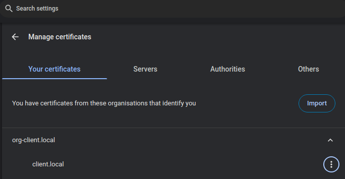
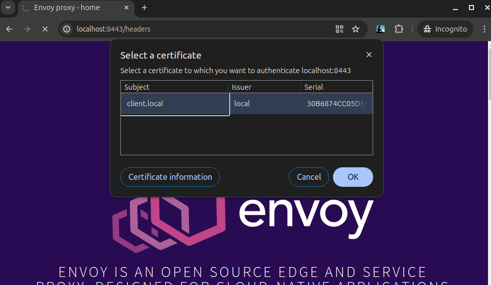

# Accept Untrusted Test case

This is relating to: https://github.com/envoyproxy/envoy/issues/30091

This repo was cloned from: https://github.com/jewertow/envoy-playground/blob/master/ssl-accept-untrusted/README.md

The changes are to remove the curl client and call the endpoint from a browser.


1. Generate SSL certificates
```shell
curl https://raw.githubusercontent.com/jewertow/openssl-cert-gen/master/tls.sh | sh -s - --subject="untrusted-client.local"
rm root-ca.crt root-ca.key

curl https://raw.githubusercontent.com/jewertow/openssl-cert-gen/master/tls.sh | sh -s - --subject="local" --root-cert
curl https://raw.githubusercontent.com/jewertow/openssl-cert-gen/master/tls.sh | sh -s - --subject="client.local" --root-cert-path=root-ca.crt --root-key-path=root-ca.key
curl https://raw.githubusercontent.com/jewertow/openssl-cert-gen/master/tls.sh | sh -s - --subject="gateway.local" --root-cert-path=root-ca.crt --root-key-path=root-ca.key
```

2. Verify certificates:
```shell
openssl verify -verbose -CAfile root-ca.crt untrusted-client.local.crt
CN = untrusted-client.local
error 20 at 0 depth lookup: unable to get local issuer certificate
error untrusted-client.local.crt: verification failed
```
```shell
openssl verify -verbose -CAfile root-ca.crt client.local.crt
gateway.local.crt: OK
```

3. Run containers:
```shell
docker compose up
```

4. Test
Open https://localhost:8443/headers 

```JSON
{
  "headers": {
    "Accept": "text/html,application/xhtml+xml,application/xml;q=0.9,image/avif,image/webp,image/apng,*/*;q=0.8,application/signed-exchange;v=b3;q=0.7", 
    "Accept-Encoding": "gzip, deflate, br, zstd", 
    "Accept-Language": "en-US,en;q=0.9,en-GB;q=0.8", 
    "Dnt": "1", 
    "Host": "localhost:8443", 
    "Sec-Ch-Ua": "\"Chromium\";v=\"124\", \"Google Chrome\";v=\"124\", \"Not-A.Brand\";v=\"99\"", 
    "Sec-Ch-Ua-Mobile": "?0", 
    "Sec-Ch-Ua-Platform": "\"Linux\"", 
    "Sec-Fetch-Dest": "document", 
    "Sec-Fetch-Mode": "navigate", 
    "Sec-Fetch-Site": "none", 
    "Sec-Fetch-User": "?1", 
    "Upgrade-Insecure-Requests": "1", 
    "User-Agent": "Mozilla/5.0 (X11; Linux x86_64) AppleWebKit/537.36 (KHTML, like Gecko) Chrome/124.0.0.0 Safari/537.36", 
    "X-Envoy-Expected-Rq-Timeout-Ms": "15000"
  }
}
```

All as expected. No prompt and Envoy responds as expected. 

5. Install a client certificate in the browser.
Open [chrome://settings/certificates](chrome://settings/certificates)



6. Repeat the Test
Open https://localhost:8443/headers

Chrome will prompt you for a client certificate.



Irrespective of whether or not I select a certificate the request will succeed but it's this prompt that is the core of the issue. Setting SSL_VERIFY_NONE should fix it.
